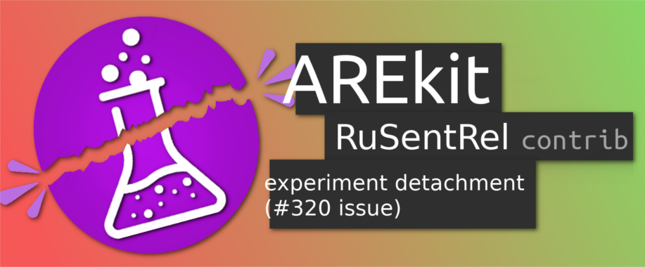

# RuSentRel Experiments `contrib`


<p align="center">
    
</p>

This part is related to the commit/state of the [AREkit](https://github.com/pulls) project, which could be taken as follows: 

```console
pip3 install git+https://github.com/nicolay-r/AREkit@ca1e647c4acc102d1b4f57709f554ec2adbd6dc7
```
